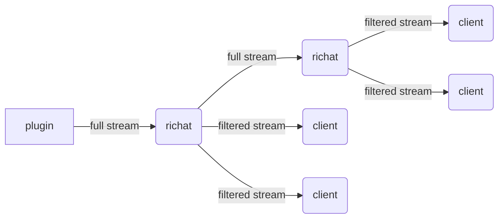
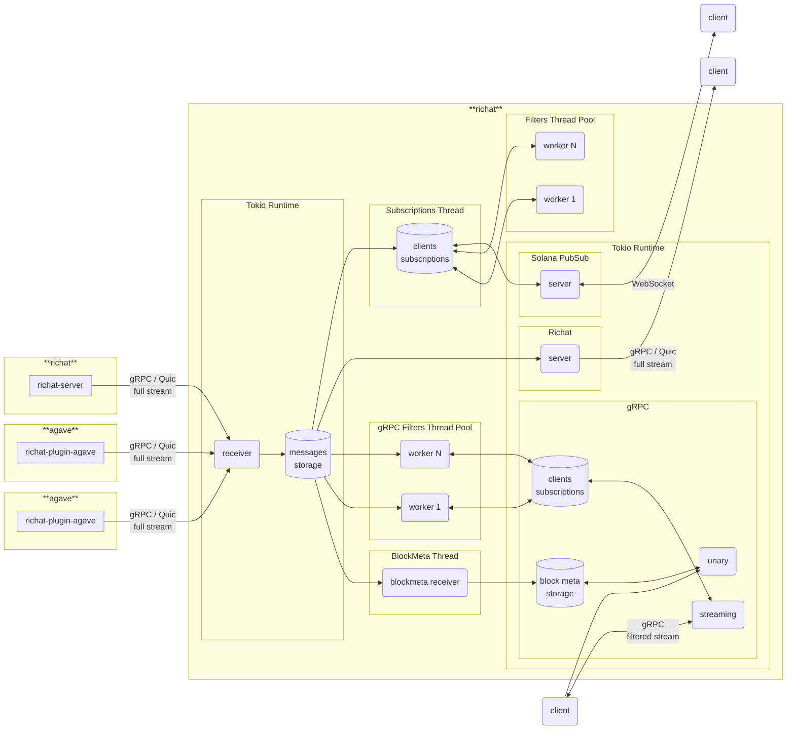

# richat

Richat is a streaming system designed to provide low latency and reliable streams of Solana blockchain data.

Richat offers a set of functionality to consume, filter and distribute streams of transactions, accounts and slots:

- Multiplexing, listening to multiple sources and providing a single stream output
- High performance filtering and de-duplication
- QUIC based streaming for higher throughput and lower latency
- gRPC support compatible with [Dragon's Mouth](https://github.com/rpcpool/yellowstone-grpc) clients
- Websockets interface compatible with the Websockets API provided by Agave

Richat can connect to a variety of sources even combining multiple different sources:

- Any [Yellowstone Dragon's Mouth / Geyser gRPC](https://github.com/rpcpool/yellowstone-grpc) compatible streaming endpoint
- Solana nodes running the included [richat-plugin-agave plugin](./plugin-agave)
- Solana nodes running the [Yellowstone Dragon's Mouth Geyser gRPC plugin](https://github.com/rpcpool/yellowstone-grpc)
- Other instances of Richat to create hierarchical streaming topologies with filtering at each level (see below)

Use Richat to build your own streaming infrastructure, whether you require websockets for browser clients or gRPC/QUIC for high performance backends. Richat is compatbile with the gRPC endpoints provided by most commerical Solana RPC providers and allows you to leverage a small number of incoming streams to serve a large number of clients.

Please use issues only for reporting bugs or discussing feature-related topics. If you're having trouble loading a plugin or need guidance on how to use crates, please post your question in the Telegram group: [https://t.me/lamportsdev](https://t.me/lamportsdev)

## Building and running

Build Richat by running

```bash
cargo build --release
```

Then create a config with your details following the example [config.yml](./richat/config.yml) and run Richat with:

```bash
./target/release/richat --config path/to/your/config.yml
```

## Sponsored by

## Blueprint





## Components

- `cli` — CLI client for full stream, gRPC stream with filters, simple Solana PubSub
- `client` — library for building consumers
- `filter` — library for filtering geyser messages
- `plugin-agave` — Agave validator geyser plugin https://docs.anza.xyz/validator/geyser
- `proto` — library with proto files, re-imports structs from crate `yellowstone-grpc-proto`
- `richat` — app with full stream consumer and producers: gRPC (`Dragon's Mouth`), Solana PubSub
- `shared` — shared code between components (except `client`)

## Releases

#### Branches

- `master` — development branch
- `agave-v2.0` — development branch for agave v2.0
- `agave-v2.1` — development branch for agave v2.1
- `agave-v2.2` — development branch for agave v2.2

#### Tags

- `cli-v0.0.0`
- `client-v0.0.0`
- `filter-v0.0.0`
- `plugin-agave-v0.0.0`
- `plugin-agave-v0.0.0+solana.2.1.5`
- `proto-v0.0.0`
- `richat-v0.0.0`
- `shared-v0.0.0`

At one moment of time we can support more than one agave version (like v2.0 and v2.1), as result we can have two different major supported versions of every component, for example: `cli-v1.y.z` for `agave-v2.0` and `cli-v2.y.z` for `agave-v2.1`. In addition to standard version, `plugin-agave` can have one or more tags with pinned solana version.

## List of RPC providers with Dragon's Mouth support

- `Allnodes` — https://www.allnodes.com/
- `Blockdaemon` - https://blockdaemon.com/
- `Chainstack` — https://chainstack.com/
- `Corvus Labs` — https://corvus-labs.io/
- `ERPC` — https://erpc.global/en/
- `Gadfly Node` — https://gadflynode.com/
- `Geeks Labs` — https://discord.gg/geekslabs
- `GetBlock` — https://getblock.io/
- `Helius` — https://www.helius.dev/
- `InstantNodes` — https://instantnodes.io/
- `OrbitFlare` — https://orbitflare.com/
- `PixelLabz` — https://pixellabz.io/
- `PublicNode` — https://solana-rpc.publicnode.com/
- `QuickNode` — https://www.quicknode.com/
- `Shyft` — https://shyft.to/
- `Solana Tracker` — https://www.solanatracker.io/solana-rpc
- `Solana Vibe Station` — https://www.solanavibestation.com/
- `SolSqueezer` — https://solsqueezer.io/
- `Triton One` — https://triton.one/
- `Urban Node` — https://urbannode.io/

If your RPC provider not in the list, please open Issue / PR!
